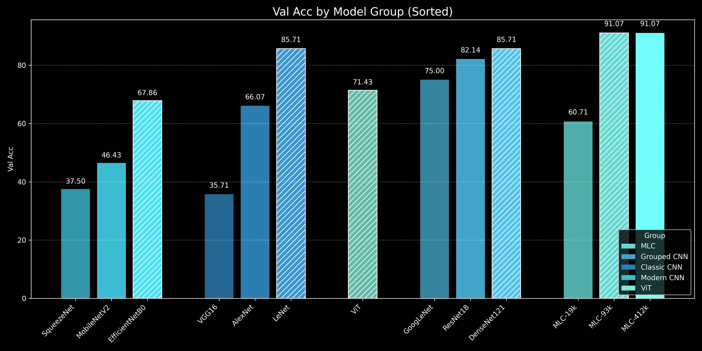

# Core-Collapse
Core Collapse provides a focused scope for designing efficient, high-performing models by challenging the assumption that bigger always means better

# 🧠 Model Parameter Comparison

A comparative overview of deep learning models based on the number of **trainable parameters**. Useful for selecting models depending on hardware constraints, training time, or deployment environments.

---

## 📊 Model Overview

| Model Name         | Trainable Parameters | Model Type        | Description / Notes                            |
|--------------------|----------------------|-------------------|------------------------------------------------|
| LeNet              | 61,496               | CNN               | Classic convolutional network                  |
| **MLC-19k**            | **19,520**               | Custom (Private)  | Ultra-light custom model                       |
| MLC-93k            | 93,376               | Custom (Private)  | Mid-sized custom model                         |
| MLC-412k           | 412,416              | Custom (Private)  | Large MLC variant                              |
| ViT                | 85,801,732           | Vision Transformer| Transformer-based vision model                 |
| EfficientNetB0     | 4,012,672            | Efficient CNN     | Scaled model balancing accuracy and size       |
| GoogLeNet          | 5,604,004            | Inception CNN     | Efficient multi-path convolutional network     |
| ResNet18           | 11,178,564           | Residual CNN      | Residual connections to combat vanishing grads |
| AlexNet            | 57,020,228           | Classic CNN       | First deep CNN for large-scale classification  |
| **VGG16**              | **134,276,932**          | Deep CNN          | Deep stack of conv layers, high parameter count|
| DenseNet121        | 6,957,956            | Dense CNN         | Dense connections for feature reuse            |
| SqueezeNet         | 737,476              | Compact CNN	      | Tiny model with squeeze-expand modules         |
| MobileNetV2        | 2,228,996            | Mobile CNN	      | Lightweight CNN with inverted residuals for edge usage |

---

## 🔍 Goals

- 📉 **Analyze trade-offs** between parameter count and model performance.
- 🧪 **Benchmark custom vs public models** (e.g., MLC vs LeNet, ViT).
- ⚙️ **Select optimal models** for edge devices or GPU training.

---

---

# Validate Accurate

  

