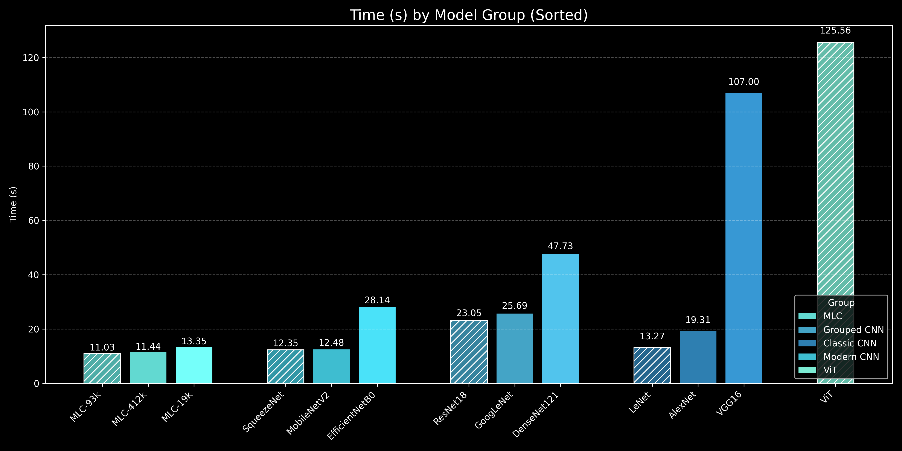

# Core-Collapse
Core Collapse provides a focused scope for designing efficient, high-performing models by challenging the assumption that bigger always means better

# 🧠 Model Parameter Comparison

A comparative overview of deep learning models based on the number of **trainable parameters**. Useful for selecting models depending on hardware constraints, training time, or deployment environments.

---

## 📊 Model Overview

| Model Name         | Trainable Parameters | Model Type        | Description / Notes                            |
|--------------------|----------------------|-------------------|------------------------------------------------|
| LeNet              | 61,496               | CNN               | Classic convolutional network                  |
| **MLC.α-19k**            | **19,520**               | Custom (Private)  | Ultra-light custom model                       |
| MLC.α-93k          | 93,376               | MLC.α  (Private)  | Mid-sized custom model                         |
| MLC.α-412k         | 412,416              | MLC.α  (Private)  | Large MLC variant                              |
| MLC.β-159K         | 159,872              | MLC.β  (Private)  | New variant with Gate MLP                      |
| ViT                | 85,801,732           | Vision Transformer| Transformer-based vision model                 |
| EfficientNetB0     | 4,012,672            | Efficient CNN     | Scaled model balancing accuracy and size       |
| GoogLeNet          | 5,604,004            | Inception CNN     | Efficient multi-path convolutional network     |
| ResNet18           | 11,178,564           | Residual CNN      | Residual connections to combat vanishing grads |
| AlexNet            | 57,020,228           | Classic CNN       | First deep CNN for large-scale classification  |
| **VGG16**              | **134,276,932**          | Deep CNN          | Deep stack of conv layers, high parameter count|
| DenseNet121        | 6,957,956            | Dense CNN         | Dense connections for feature reuse            |
| SqueezeNet         | 737,476              | Compact CNN	      | Tiny model with squeeze-expand modules         |
| MobileNetV2        | 2,228,996            | Mobile CNN	      | Lightweight CNN with inverted residuals for edge usage |

---

## 🔍 Goals

- 📉 **Analyze trade-offs** between parameter count and model performance.
- 🧪 **Benchmark custom vs public models** (e.g., MLC vs LeNet, ViT).
- ⚙️ **Select optimal models** for edge devices or GPU training.

---

---

# Train Accurate

  

##
This chart shows how well each model learned from the training dataset. A higher training accuracy indicates that the model was able to effectively identify patterns in the data it was trained on.

- **Top Performer**: The MLC-412k model achieved the highest training accuracy of 91.23.

- **Other High Performers**: Models like ResNet18 (86.84), DenseNet121 (86.84), and LeNet (85.96) also showed strong performance on the training data.

- **Lowest Performer**: SqueezeNet had the lowest training accuracy at 38.60.

##

# Validate Accurate

  

##
This chart is crucial as it shows how well each model performs on new, unseen data. This is a better measure of the model's ability to generalize and its real-world effectiveness.

- **Top Performers**: The MLC-412k and MLC-93k models were the top performers, both achieving an excellent validation accuracy of 91.07.

- **Strong Generalization**: Models like LeNet (85.71) and DenseNet121 (85.71) also demonstrated strong generalization from their training results.

- **Lowest Performer**: VGG16 had the lowest validation accuracy at 35.71.

# Time (s)

  

